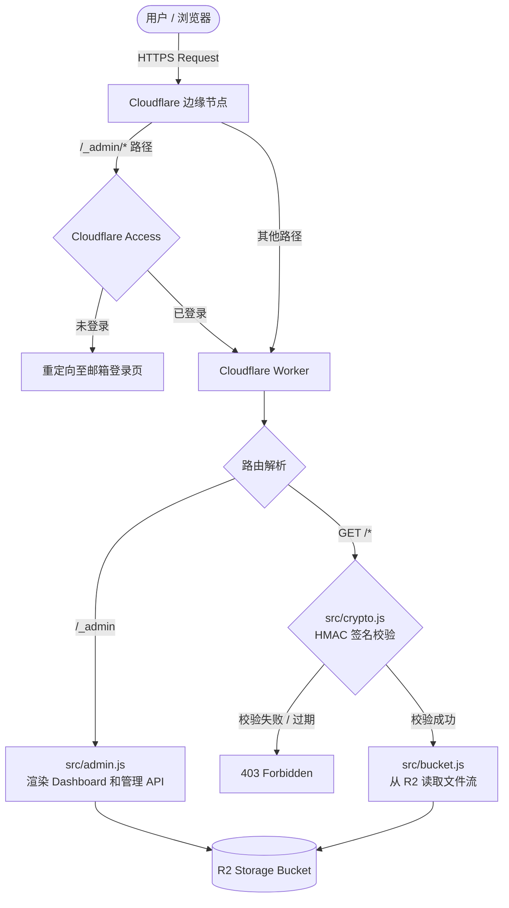

# Cloudflare R2 Share - 私人文件分享与管理系统

基于 **Cloudflare Workers** 和 **Cloudflare R2** 构建的轻量级、高安全性私人文件存储与分享系统。

专为"个人偶尔分享文件"的场景设计。通过高度定制的安全策略（Cloudflare Access + HMAC 动态签名），在彻底杜绝 R2 存储桶被公网恶意刷流量的同时，保留了极简的直连下载体验。

---

## 技术栈

| 层级 | 技术 |
|------|------|
| 计算层 | Cloudflare Workers (JavaScript / V8 Isolate) |
| 存储层 | Cloudflare R2 Object Storage |
| 安全认证 | Cloudflare Access (Zero Trust) 邮箱验证 + HMAC-SHA256 动态签名 |
| 前端界面 | 原生 HTML5 + CSS3 + Vanilla JS（内置渲染，零外部依赖） |

---

## 核心特性

1. **动态签名保护：** 每个分享链接均根据文件名、过期时间、文件版本盐值和一次性标记动态生成 HMAC-SHA256 签名，防止横向越权访问。
2. **链接时效性：** 支持设置链接有效期（默认 24 小时，最长 30 天），过期自动失效。
3. **一次性链接（One-Time Link）：** 支持生成仅可访问一次的下载链接，首次访问后自动吊销，适合发送敏感文件。
4. **链接吊销（Revoke）：** 支持一键吊销某个文件的所有已签发链接，通过更新文件元数据中的版本盐值使旧签名立即失效，无需删除文件。
5. **多密钥轮转支持：** 签名支持 `kid`（Key ID）参数，可在 `AUTH_SECRET` 中以 JSON 形式配置多个密钥，实现平滑密钥轮换。
6. **大文件分片上传：** 突破 Cloudflare Workers 免费版 100MB 请求体限制，前端使用 40MB 自动切片并发流式上传，单文件最大支持 5GB。
7. **存储配额管理：** 可配置总存储上限（默认 10GB），上传前自动校验，超限拒绝上传。
8. **文件类型白名单：** 仅允许上传指定扩展名的文件类型，防止恶意文件上传。
9. **完美中文支持：** 严格遵循 RFC 5987 标准（`filename*=UTF-8''`），彻底解决下载时中文文件名乱码问题。
10. **CORS 跨域支持：** 完整处理 `OPTIONS` 预检请求并全局注入 CORS 头，允许从其他域名安全调用 API 或下载资源。
11. **深度防探测机制：** 统一签名错误与资源不存在时的返回行为（模糊处理），避免攻击者通过响应差异进行文件枚举探测。
12. **安全响应头：** 自动注入 `X-Robots-Tag: noindex` 防止搜索引擎索引、`X-Content-Type-Options: nosniff` 防止 MIME 嗅探、`Cache-Control: private` 防止共享缓存泄露。
13. **模块化架构：** 代码结构清晰，将加密校验、Bucket 操作、管理后台、日志记录解耦为独立模块，易于二次开发和维护。

---

## 系统架构与请求路由



### 路由说明

| 路径 | 方法 | 认证方式 | 说明 |
|------|------|----------|------|
| `/_admin` | GET | Cloudflare Access | 管理后台 Dashboard |
| `/_admin/api/sign` | GET | Cloudflare Access | 生成文件分享签名链接 |
| `/_admin/api/revoke` | POST | Cloudflare Access | 吊销文件所有已签发链接 |
| `/_admin/api/delete/*` | DELETE | Cloudflare Access | 删除文件 |
| `/_admin/api/multipart/start` | GET | Cloudflare Access | 初始化分片上传 |
| `/_admin/api/multipart/upload` | PUT | Cloudflare Access | 上传分片 |
| `/_admin/api/multipart/complete` | POST | Cloudflare Access | 完成分片上传 |
| `/_admin/api/multipart/abort` | DELETE | Cloudflare Access | 中止分片上传 |
| `/{filename}?s=&e=&k=&ot=` | GET | HMAC 签名 | 公开下载文件 |

### 公开下载 URL 参数

| 参数 | 必填 | 说明 |
|------|------|------|
| `s` | 是 | HMAC-SHA256 签名值 |
| `e` | 是 | 过期时间戳（Unix 秒） |
| `k` | 否 | 密钥 ID，默认 `v1` |
| `ot` | 否 | 是否为一次性链接，`1` 表示启用 |

---

## 目录结构

```
file-share-worker/
├── src/
│   ├── index.js      # 主入口，路由分发、安全检查、CORS 处理
│   ├── crypto.js     # HMAC-SHA256 签名生成、校验及恒定时间比较
│   ├── admin.js      # 管理后台 Dashboard 及所有管理 API
│   ├── bucket.js     # R2 存储桶操作抽象层（文件读取、Range 支持）
│   └── logger.js     # 结构化日志及 Analytics Engine 上报
├── public/
│   └── favicon.png   # 站点图标
├── test/
│   └── index.spec.js # Vitest 单元测试
├── wrangler.jsonc    # Wrangler 配置文件
├── vitest.config.js  # Vitest 配置
└── package.json
```

---

## 快速开始

### 前置条件

- Node.js 18+
- pnpm
- Cloudflare 账号
- 已创建 R2 存储桶

### 1. 克隆并安装依赖

```bash
pnpm install
```

### 2. 配置 R2 存储桶

编辑 `wrangler.jsonc`，将 `r2_buckets[0].bucket_name` 修改为你的 R2 存储桶名称：

```jsonc
"r2_buckets": [
  {
    "binding": "BUCKET",
    "bucket_name": "你的存储桶名称"
  }
]
```

### 3. 配置密钥

```bash
# 设置 HMAC 签名密钥（生产环境必填）
npx wrangler secret put AUTH_SECRET
```

输入一个随机长字符串作为 HMAC 签名密钥。建议使用以下命令生成：

```bash
openssl rand -base64 32
```

### 4. 配置管理员邮箱

```bash
# 设置管理员邮箱列表，多个邮箱用逗号分隔
npx wrangler secret put ADMIN_EMAILS
```

输入格式：`admin@example.com,admin2@example.com`

### 5. 本地开发

```bash
pnpm run dev
```

### 6. 部署

```bash
pnpm run deploy
```

---

## 环境变量

| 变量名 | 类型 | 必填 | 默认值 | 说明 |
|--------|------|------|--------|------|
| `AUTH_SECRET` | Secret | 生产环境必填 | - | HMAC 签名密钥。支持两种格式：<br>• 纯字符串：作为 `kid=v1` 的密钥<br>• JSON 对象：`{"v1":"密钥1","v2":"密钥2"}` 支持多密钥轮转 |
| `ADMIN_EMAILS` | Secret | 是 | - | 管理员邮箱列表，支持多个邮箱用逗号分隔（如 `a@b.com,c@d.com`） |
| `GET_SIGNATURE` | Secret | 否 | - | 兼容旧版，若未设置 `AUTH_SECRET` 则回退使用此变量 |
| `TOTAL_QUOTA_GB` | Var | 否 | `10` | 存储总配额（GB），超出后拒绝上传 |
| `ALLOW_DIRECT_ACCESS` | Var | 否 | `false` | 是否允许通过 `.workers.dev` 域名直接访问（生产环境已强制禁止，无需此变量） |

---

## 生产环境部署检查清单

### 1. Cloudflare Access 配置

在 Cloudflare Zero Trust 控制台为 `/_admin*` 路径创建 Access Application：

1. 进入 Zero Trust Dashboard → Access → Applications
2. 创建 Self-hosted 应用，Application Domain 填写你的自定义域名
3. Path 设置为 `/_admin*`
4. 在 Policy 中配置仅允许管理员邮箱访问

### 2. 管理员邮箱配置

管理员邮箱通过环境变量 `ADMIN_EMAILS` 管理，系统会自动校验 `CF-Access-Authenticated-User-Email` 请求头是否在白名单中。

```bash
npx wrangler secret put ADMIN_EMAILS
# 输入: user1@example.com,user2@example.com
```

### 3. 自定义域名绑定

在 Worker → Settings → Domains 中绑定自定义域名。建议在 `wrangler.jsonc` 中保持 `"workers_dev": false` 以禁用 `.workers.dev` 直接访问。

### 4. R2 生命周期规则（重要）

必须在 R2 存储桶上配置生命周期规则：

- **自动中止未完成的分片上传：** 设置 N 天（建议 1 天）后自动中止，防止上传失败产生孤儿分片，造成隐性存储费用。
- **自动清理过期文件：** 根据需要设置过期删除规则，节省存储空间。

### 5. Analytics Engine（可选）

系统已内置结构化日志。如需在 Cloudflare Dashboard 查看操作统计：

1. 在 Cloudflare Dashboard 创建 Analytics Engine 数据集
2. 取消 `wrangler.jsonc` 中 `analytics_engine_datasets` 配置的注释，填写正确的 `dataset` 名称
3. 重新部署

### 6. 安全加固

- 系统已内置分片上传失败自动中止（Abort）逻辑
- 签名校验采用恒定时间比较，防止时序攻击
- 签名错误与资源不存在统一返回 403，防止信息泄露
- 生产环境自动阻止 `.workers.dev` 域名直接访问
- **防索引保护**：自动注入 `X-Robots-Tag: noindex` 响应头，防止搜索引擎抓取已签发的链接。
- **缓存控制**：强制 `Cache-Control: private`，防止共享 CDN 缓存私有签名内容。

---

## 速率限制与滥用防护 (Rate Limiting)

由于下载链接是公开的（仅受签名保护），为了防止链接泄露后的恶意刷流，建议在 Cloudflare Dashboard 中配置 **WAF 速率限制规则**。

### 配置步骤

1. 登录 Cloudflare 控制台 → **安全性 (Security)** → **WAF** → **速率限制规则 (Rate Limiting Rules)**。
2. 创建规则：
   - **名称**: `Limit R2 Downloads`
   - **匹配条件**:
     - `URI 路径` 不等于 `/_admin*`（排除管理后台）
     - `URI 路径` 不等于 `/favicon.png`
   - **速率设置**:
     - **请求频率**: 建议 `100` 次请求 / `1 分钟`（按 IP 统计）。
     - **操作**: `阻止 (Block)` 或 `JS 挑战`。
3. 针对管理员 API 的额外保护：
   - 创建规则针对路径 `/_admin/api/sign`。
   - 限制频率（如 `10` 次请求 / `10 秒`），防止签名接口被盗用后高频暴力调用。

---

## 允许上传的文件类型

默认白名单（可在 `src/admin.js` 中修改 `ALLOWED_EXTENSIONS` 数组）：

| 分类 | 扩展名 |
|------|--------|
| 图片 | `jpg` `jpeg` `png` `gif` `webp` |
| 视频 | `mp4` `mov` `avi` |
| 音频 | `mp3` `wav` |
| 文档 | `pdf` `doc` `docx` `xls` `xlsx` `ppt` `pptx` `txt` `md` `json` |
| 压缩包 | `zip` `rar` `7z` `gz` `tar` |

---

## 开发者指南

```bash
# 安装依赖
pnpm install

# 本地开发
pnpm run dev

# 运行测试
pnpm run test

# 部署到 Cloudflare
pnpm run deploy
```

---

## API 参考

### 生成签名链接

```
GET /_admin/api/sign?key={文件名}&exp={过期时间戳}&k={密钥ID}&ot={是否一次性}
```

**参数说明：**

| 参数 | 必填 | 默认值 | 说明 |
|------|------|--------|------|
| `key` | 是 | - | 文件名 |
| `exp` | 否 | 当前时间 + 24 小时 | 过期时间戳（Unix 秒），最长不超过当前时间 + 30 天 |
| `k` | 否 | `v1` | 密钥 ID |
| `ot` | 否 | `0` | 是否生成一次性链接，`1` 启用 |

**响应示例：**

```json
{
  "key": "example.pdf",
  "exp": 1717776000,
  "signature": "abc123...",
  "kid": "v1",
  "ot": "0",
  "url": "https://your-domain.com/example.pdf?s=abc123...&e=1717776000&k=v1"
}
```

### 吊销链接

```
POST /_admin/api/revoke?key={文件名}
```

使指定文件的所有已签发链接立即失效。

### 删除文件

```
DELETE /_admin/api/delete/{文件名}
```

### 分片上传流程

1. **初始化上传：** `GET /_admin/api/multipart/start?key={文件名}&size={文件大小}`
2. **上传分片：** `PUT /_admin/api/multipart/upload?key={文件名}&uploadId={ID}&partNumber={N}`
3. **完成上传：** `POST /_admin/api/multipart/complete?key={文件名}&uploadId={ID}` — Body 为 `[{partNumber, etag}, ...]`
4. **中止上传：** `DELETE /_admin/api/multipart/abort?key={文件名}&uploadId={ID}`

---

## 常见问题

### 如何实现密钥轮转？

在 `AUTH_SECRET` 中使用 JSON 格式配置多个密钥：

```json
{"v1":"旧密钥","v2":"新密钥"}
```

新签发的链接将使用 `kid=v2`，旧链接仍可通过 `v1` 验证。轮转完成后，移除旧密钥并重新部署即可。

### 如何吊销某个文件的分享链接？

在管理后台点击文件对应的 "Revoke Links" 按钮，系统会更新文件的版本盐值，使所有旧签名立即失效。也可以调用 API：

```
POST /_admin/api/revoke?key={文件名}
```

### 什么是一次性链接（One-Time Link）？

一次性链接在首次完整下载后会自动吊销，确保链接只能被使用一次。在管理后台点击 "One-Time Link" 按钮即可生成。技术原理：首次访问时后台通过 `waitUntil` 异步更新文件的版本盐值，使该链接的签名立即失效。

### 上传失败怎么办？

前端会在上传失败时自动调用 Abort API 清理已上传的分片。同时，R2 生命周期规则会兜底清理超时的未完成分片上传，确保不会产生额外费用。

### 如何修改链接默认有效期？

默认有效期为 24 小时。修改 `src/admin.js` 中 `handleAdminRequest` 函数里的默认值：

```javascript
let exp = requestedExp || (now + 24 * 60 * 60); // 将 24 * 60 * 60 改为你需要的秒数
```

### 下载时中文文件名乱码怎么办？

系统已内置 RFC 5987 标准处理，正常情况下不会出现乱码。如果仍有问题，请检查浏览器是否支持 `filename*=UTF-8''` 编码格式。

### 如何查看操作日志？

系统内置结构化日志输出，可在 Cloudflare Dashboard → Workers → 你的 Worker → Logs 中查看实时日志。如果配置了 Analytics Engine，还可以在 Analytics 页面查看聚合统计数据。

---

## 许可证

MIT